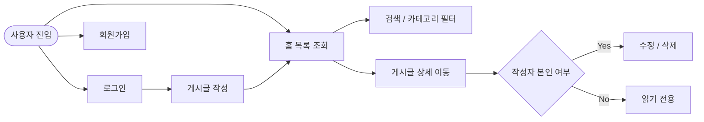

# [React + Vite 기반 Winiv Blog 프론트엔드 프로젝트]

> Weniv CRUD API를 기반으로 회원 인증과 블로그 CRUD 흐름을 구현한 React 학습형 프론트엔드 프로젝트

---

## 0. 프로젝트 개요

### 프로젝트 소개

`winivBlog`는 React와 Vite를 기반으로 구성된 블로그 서비스 프론트엔드 프로젝트입니다.  
회원가입, 로그인, 게시글 목록, 상세 조회, 작성/수정/삭제, 마이페이지 흐름을 중심으로 화면 구조와 API 연동 방식을 학습하는 데 목적이 있습니다.

추가로 저장소에는 운동 분석 JSON 데이터를 블로그 포스트 초안으로 변환하는 보조 스크립트도 포함되어 있습니다.

### 핵심 목표

| 항목 | 내용 |
| --- | --- |
| **Frontend Stack** | React 19, Vite 7, React Router 7 |
| **API Target** | Weniv CRUD API |
| **주요 도메인** | 인증, 게시글 CRUD, 검색, 마이페이지 |
| **보조 기능** | 운동 분석 요약 및 포스트 초안 생성 스크립트 |

---

## 1. 서비스 구성

### 1.1 주요 화면

| 화면 | 경로 | 설명 |
| --- | --- | --- |
| **Home** | `/` | 게시글 목록, 카테고리, 검색 패널, 무한 스크롤 |
| **Login** | `/login` | 사용자 로그인 |
| **Register** | `/register` | 회원가입 |
| **MyPage** | `/mypage` | 사용자 정보 및 작성 글 관리 |
| **Post View** | `/post/:postId` | 게시글 상세 조회 |
| **Post Write** | `/write` | 게시글 작성 및 수정 |
| **Alert** | `/alert` | 알림/모달성 화면 테스트 용도 |

### 1.2 라우팅 구조

```mermaid
graph TD
    A[MainLayout] --> B[/]
    A --> C[/login]
    A --> D[/register]
    A --> E[/mypage]
    A --> F[/post/:postId]
    A --> G[/write]
    A --> H[/alert]
    I[Component Test] --> J[/component-test]
```

### 1.3 사용자 흐름



---

## 2. 구현 범위

### 2.1 핵심 기능

* 회원가입 / 로그인
* 액세스 토큰, 리프레시 토큰 저장 및 인증 상태 유지
* 게시글 목록 조회
* 게시글 상세 조회
* 게시글 작성 / 수정 / 삭제
* 홈 검색 기능
* 카테고리 기반 필터링
* 마이페이지 화면 구성
* 공통 레이아웃(Header, Banner, Footer, Alert)

### 2.2 보조 스크립트

* API 서버용 샘플 게시글 시드 스크립트
* 백스쿼트 분석 JSON 요약 스크립트
* 분석 결과를 블로그 포스트 초안 JSON으로 변환하는 스크립트

---

## 3. 기술 스택

### 3.1 개발 환경

| 구분 | 내용 |
| --- | --- |
| **Language** | JavaScript, CSS |
| **Framework / Library** | React 19, React DOM 19, React Router DOM 7 |
| **Build Tool** | Vite 7 |
| **Lint** | ESLint 9 |
| **Package Manager** | npm |

### 3.2 상태 및 구조

| 항목 | 내용 |
| --- | --- |
| **전역 상태** | React Context (`AuthContext`, `AlertContext`) |
| **스타일링** | CSS Modules + global CSS + design variables |
| **API 계층** | `app/src/api` 내부의 client/auth/blog 모듈 |
| **SEO 처리** | 페이지별 `Seo` 컴포넌트 사용 |

---

## 4. 프로젝트 구조

```text
root
├─ app
│  ├─ public
│  ├─ scripts
│  └─ src
│     ├─ api
│     ├─ assets
│     ├─ components
│     ├─ contexts
│     ├─ layouts
│     ├─ pages
│     ├─ routes
│     ├─ seo
│     └─ utils
├─ docs
│  ├─ backSquat
│  └─ commands
└─ scripts
```

| 경로 | 설명 |
| --- | --- |
| `app/src/api` | 인증, 게시글 API 요청 함수 |
| `app/src/components` | 재사용 UI 컴포넌트 |
| `app/src/contexts` | 인증 및 알림 전역 상태 |
| `app/src/layouts` | 공통 레이아웃 |
| `app/src/pages` | 페이지 단위 컴포넌트 |
| `app/src/routes` | 라우트 상수 및 라우터 구성 |
| `app/src/utils` | 검색, 포스트 ID 변환, 글 생성 유틸리티 |
| `app/scripts` | 샘플 게시글 업로드 스크립트 |
| `scripts` | 운동 분석 관련 Python/Node 스크립트 |
| `docs` | 요구사항, API, 레이아웃, 작업 노트 |

---

## 5. 실행 방법

### 5.1 요구 사항

* Node.js 20 이상 권장
* npm
* Python 3.x

### 5.2 설치

```bash
cd app
npm install
```

### 5.3 개발 서버 실행

```bash
cd app
npm run dev
```

### 5.4 프로덕션 빌드

```bash
cd app
npm run build
```

### 5.5 빌드 결과 미리보기

```bash
cd app
npm run preview
```

### 5.6 린트

```bash
cd app
npm run lint
```

---

## 6. 환경 변수

기본 API Base URL은 Weniv CRUD API로 설정되어 있습니다.

* 기본값: `https://dev.wenivops.co.kr/services/fastapi-crud/1`

다른 API 서버를 사용하려면 `app/.env`에 아래 값을 설정합니다.

```bash
VITE_API_BASE_URL=https://example.com/services/fastapi-crud/1
```

---

## 7. API 연동 범위

### 7.1 주요 엔드포인트

| 기능 | 메서드 | 엔드포인트 |
| --- | --- | --- |
| 회원가입 | `POST` | `/signup` |
| 로그인 | `POST` | `/login` |
| 게시글 목록 조회 | `GET` | `/blog` |
| 게시글 상세 조회 | `GET` | `/blog/{id}` |
| 게시글 작성 | `POST` | `/blog` |
| 게시글 수정 | `PUT` | `/blog/{id}` |
| 게시글 삭제 | `DELETE` | `/blog/{id}` |

### 7.2 인증 메모

* 인증 토큰 저장 키: `winivBlog.authTokens`
* 인증 요청은 `Authorization: Bearer <token>` 헤더를 사용합니다.
* 상세 API 문서는 `docs/API.md`를 기준으로 관리합니다.

---

## 8. 데이터 및 자동화 스크립트

### 8.1 샘플 게시글 업로드

```bash
cd app
node scripts/seedMockPosts.mjs
```

사용 가능한 환경 변수:

* `API_BASE_URL`
* `SEED_USERNAME`
* `SEED_PASSWORD`

### 8.2 백스쿼트 분석 요약

```bash
python scripts/summarize_backsquat.py
```

입력 파일:

* `docs/backSquat/backSquat-20260311013416.json`

출력 파일:

* `docs/backSquat/backSquat-summary.json`

### 8.3 ChatGPT 요청 payload 생성

```bash
python scripts/build_backsquat_payload.py
```

출력 파일:

* `docs/backSquat/chatgpt-request-final.json`

### 8.4 블로그 포스트 초안 생성

```bash
node scripts/generate_exercise_post.mjs docs/backSquat/backSquat-summary.json
```

기본 출력 파일:

* `docs/backSquat/backSquat-post.json`

---

## 9. 문서 정리

| 문서 | 설명 |
| --- | --- |
| `docs/Requirements.md` | 요구사항 및 현재 구현 검토 메모 |
| `docs/API.md` | API 명세 정리 |
| `docs/Layout.md` | 페이지 배치 및 레이아웃 메모 |
| `docs/commands/frontend.md` | 프론트엔드 작업 가이드 |
| `docs/commands/backend.md` | 백엔드/API 관련 메모 |
| `docs/commands/deploy.md` | 배포 관련 메모 |

---

## 10. 현재 상태 메모

이 저장소는 학습과 구조화에 초점을 맞춘 프로젝트이며, `docs/Requirements.md` 기준으로 일부 요구사항은 추가 보완이 필요한 상태입니다.  
따라서 기능 현황을 최종 판정할 때는 README보다 `docs/Requirements.md`의 검토 결과를 우선적으로 참고하는 편이 정확합니다.

---

## 11. 참고 경로

* 앱 진입점: `app/src/main.jsx`
* 라우터: `app/src/routes/AppRouter.jsx`
* API 클라이언트: `app/src/api/client.js`
* 운동 글 생성 유틸: `app/src/utils/exercisePostGenerator.js`
